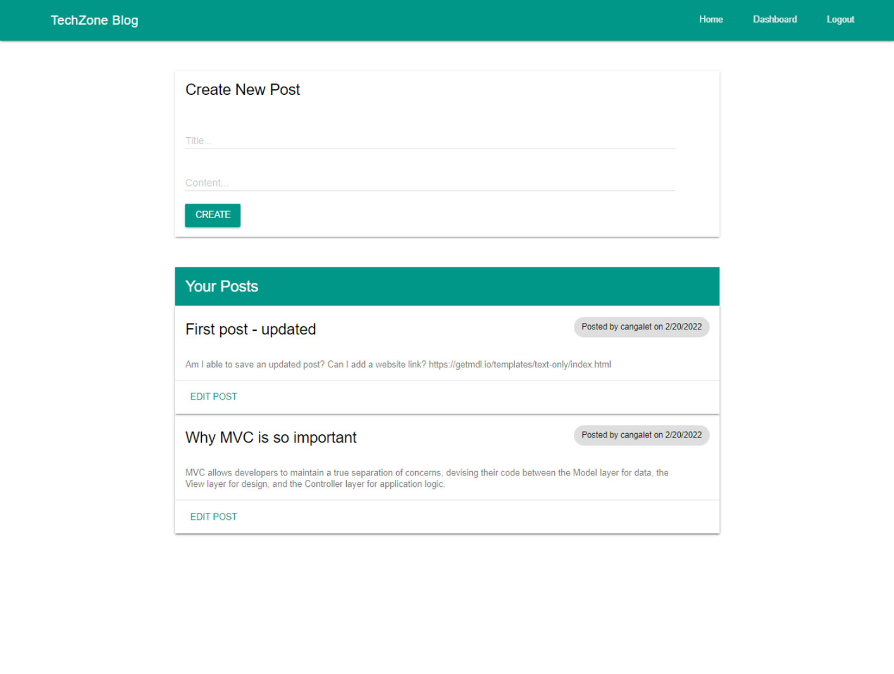

# CHLG-Tech-Blog

_You can access more badges and their purposes at [shields.io](https://shields.io)_

## Description:

TechZone blog is a CMS-style blog site similar to a Wordpress site, where developers can publish their blog posts and comment on other developers’ posts as well. This app uses Handlebars.js as the templating language, Sequelize as the ORM, and the express-session npm package for authentication and is hosted on Heroku

----------------------------------

## Table of Contents:
- [Description](#description)
- [Installation](#installation)
- [Usage](#usage)
- [License](#license)
- [Questions](#questions)

----------------------------------

## Installation:

_Follow these steps to properly install this application:_

Download the repo from Github.  Run npm install for the following dependencies in your CLI, inquirer, fs, and util.

## Usage:

- Open terminal
- Run node index.js in the CLI
- Answer the prompts that follow
- Heroku App: https://rocky-woodland-70089.herokuapp.com/

## License:

NOTICE: This application is covered by [MIT License](https://choosealicense.com/licenses/mit/).

## Questions:

- Github: [cangalet](https://github.com/cangalet)
- Email:  cangalet@gmail.com
  